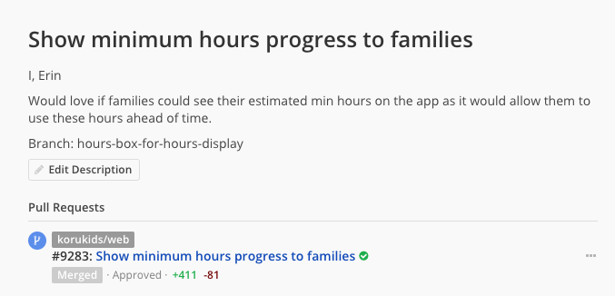
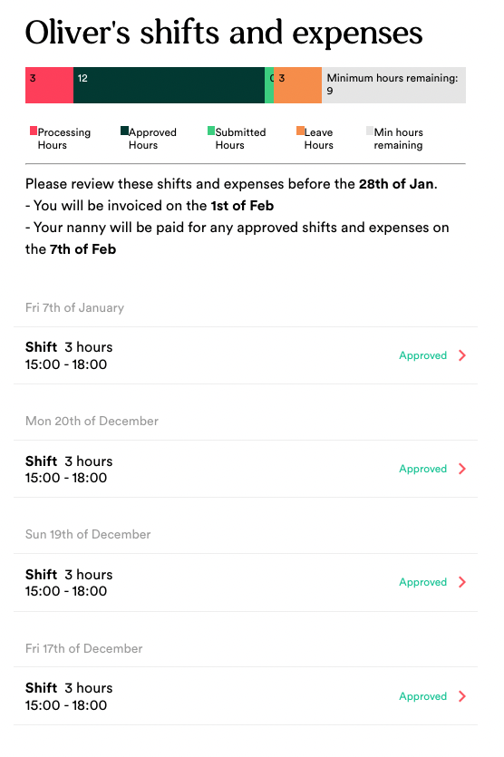
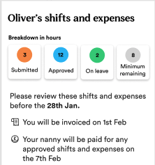
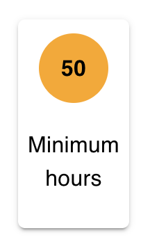
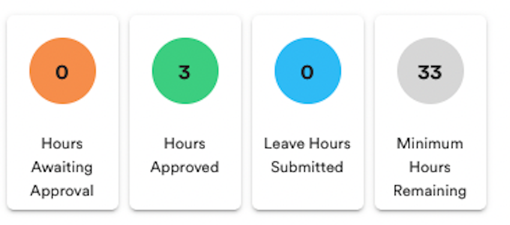
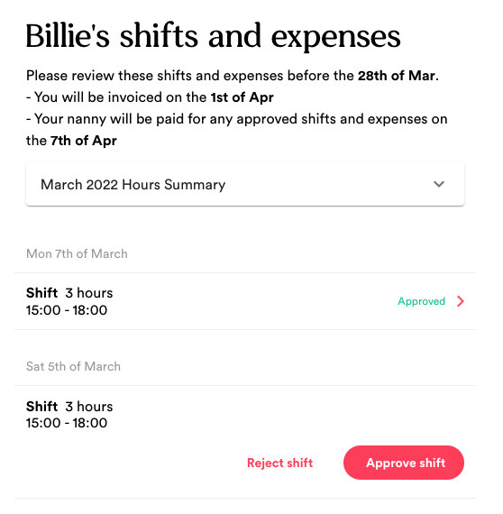
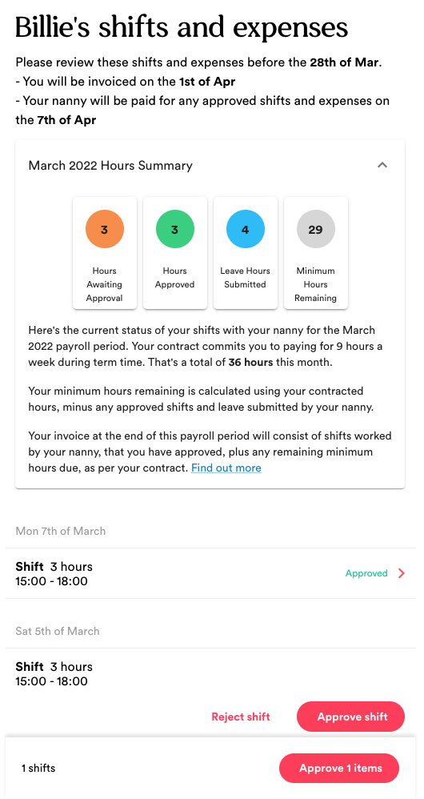
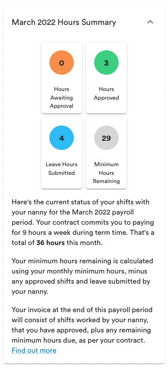
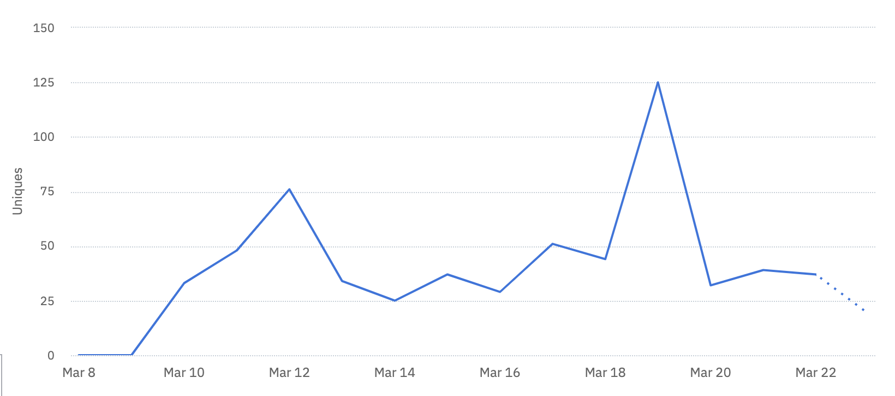

# Introduction

My name is Dan Marshall, and I am an Associate Engineer at Koru Kids, a childcare company based in London. I attended the Makers Academy Bootcamp programme from 6th September - 27th November 2021

This document is my portfolio submission for the Software Developer V1.1 Level 4 Apprenticeship scheme

# Koru Kids

Koru Kids is building the world’s best childcare service, starting in London and now expanding to the rest of the UK. We’re making it easier and more affordable for families to access high quality childcare.

Koru Kids recruits and trains people to be top class childcarers and offers an after school nanny, early years nanny and Home Nursery services to families.

## My role at Koru Kids

I started working at Koru Kids in September 2018 in Operations, before moving to Payroll Operations in 2019. My roles involved building low and no-code systems to allow us to invoice up to 1800 families, and pay 1800 nannies each month. Koru Kids started only 5 years ago, as an Operations heavy company, so many of our systems were originally built without engineering capacity and so the things I built were used while our engineering team were working their way towards ‘productising’ everything.

I attended Makers Academy Bootcamp in Sept 2021 on the recommendation of a member of the engineering team, and since returning I have been working in the ‘Essentials Team’

## Koru Kids Engineering Team

The Essentials Team currently consists of myself, an Associate Engineer, and 2 other Senior Engineers - our domain is around everything involving the relationships between families and nannies who are currently working together. Our largest service is the ‘Afterschool Service’, so this largely involves improving and maintaining payroll systems to ensure a smooth invoicing and paying experience for our families, nannies, and the operations team at Koru Kids, but can extend to contracts, trials, and a host of other ‘essential services’ for our working relationships.

### Tech Stack

Koru Kids works largely in Ruby, Ruby on Rails and ReactJS, with other languages sprinkled around such as HAML for page and email rendering

# Project 1 - Minimum Hours Summary

## Project Outline

This ticket was suggested during our Christmas Hack Day event on the 22nd December 2021 - every now and again, the engineering team will do a hack day to work on problems that are affecting the company, but aren’t priority enough to be part of our regular workflow. 

||
|-|
|Image 1 - the ticket from the hack day event|

This ticket was suggested by someone in our customer service team as part of this hack day *(image 1).* I picked up this ticket as the problem to solve during the hack day as it was something that I had experienced the side effects of in my old role at Koru Kids so I had a good context for what the issue was already. I, along with an engineer from another team, worked on this ticket together for the period of the hack day, and put forward a first draft to the company that afternoon. The ticket then sat on my backlog after Christmas, as there were more pressing team priorities that took place, but I then picked it up again in early March when I had some free time to be able to work on the project.

## The Problem

At Koru Kids, our contracts between families and nannies have a ‘Minimum Hours’ clause, which commits our families to paying for a minimum number of hours worked by a nanny each month. This is to ensure that our nannies are being paid at least their contracted hours, and won’t be exploited into zero hours contracts. However, as our nannies are contracted to work on a weekly basis, and during term-time only, this monthly total can vary from month to month. We ‘pro-rata’ our minimum hours each payroll month based on the number of working days in that month, so the calculation is sound, the ability to display this calculation to users is not

The main issue with the varying minimum hours per month is that our families won’t know what this amount is until the end of the month when we send them their invoice, or how close they are to meeting that target throughout the month. This inevitably leads to queries coming in to the customer service team around invoicing, with families asking how this number is calculated, why they are being charged, and what the total number of hours are for the given month. We send out over 1,500 invoices each month, so the number of queries relating to Minimum Hours can be huge, taking up a lot of valuable customer service time.

Customer service answer X number of emails each week, and in payroll periods this can increase up to Y - diving into the numbers shows that Z% of these queries are related to families enquiring about minimum hours, so reducing the number of emails received will be a huge time save for the team. 

## The Solution

The solution that I came up with was to have a status update on the timesheet review page for families - this is the page that families come to each time they need to approve/reject a shift submitted by a nanny, so is the ideal place to surface this information. I wanted to create some sort of graph or visual display for the number of hours in each ‘category’, so that it would be at least clear to families the distinction between the different numbers in a clean and simple way, rather than long, wordy paragraphs explaining what the numbers meant.

### Version 1

Version 1 of this solution was built on the hack day, the idea being a progress bar to display the current summary of the nanny’s hours worked. The components of the minimum hours summary (ie. the numbers that are added together to result in a final ‘topup’) are: 

||
|-|
|Image 2 - The first draft of the Minimum Hours Summary, a progress bar|

- Submitted Hours - hours submitted by a nanny that have not yet been approved by the family)
- Approved Hours - hours submitted by a nanny that ***have*** been approved by the family)
- Leave Hours - hours submitted by a nanny to say that they were unable to work their shift, either due to illness or holiday etc. We would not charge a family for those hours, so they would be deducted from the final topup
- Processing Hours - hours that have been submitted by the nanny, approved by the family, and are currently sat with the payroll team, ready to go onto the final monthly invoice.
- Minimum Hours Remaining - The total number of minimum hours for the month, minus all the above numbers, leaving the topup amount

I elected to build a progress bar, as it would not only show the family all of this information in one contiguous place, but is also a great way to display the ratios/percentages that each component makes of the whole minimum hours total. This means families have a relative way of seeing how much more they need to utilise their nanny’s time, to not be charged a topup.

As shown in image 2, the family would have a Minimum Hours total of 27 hours for this month. Their nanny had 3 hours processing, 12 hours approved, and had submitted 3 hours of leave, resulting in 9 hours left of this month’s Minimum Hours, which would be charged on their invoice if they didn’t meet that requirement.

This project was part of a hack day, so creating a product in a day was the objective, not necessarily creating the ‘perfect solution’ straight away, but from this day of work, I could immediately tell that this solution wasn’t good enough to publish.

Firstly, it was clear that the progress bar was trying to convey too much information in a short space, and wasn’t doing a good job of it! The calculation of this Minimum Hours number was still a mystery, and this bar wasn’t helping explain that. The design was also horrible, so I parked this ticket over Christmas, and would come back to it in the New Year.

### Further Research and Design

In the New Year, I worked with one of our designers to create a better solution to this problem. The idea that was sketched out was to use bubbles to detail the relevant ‘categories’ of the shifts and minimum hours. This way, the number of hours in each group was clearer, and the overall design fitted more with our branding.

I also had a meeting with a few members of the customer service team, taking this design to them. I wanted to understand what were the most common queries they received regarding Minimum Hours, and whether this design would answer those questions.

||
|-|
|Image 3 - Design for Version 2|

The overall view from customer service was that this design was much clearer that the original progress bar, and conveyed the calculation better. They did, however, say that there needed to be some copy accompanying this diagram to both explain the complex issue better, and triage any further queries to the right place. We worked together on the copy that would be most suitable, and how this should be displayed to the user.

### Version 2

Version 2 of the Minimum Hours Summary was based on the design shown in Image 3. Using Material UI, our component library of choice at Koru Kids, I created custom components for the individual box (Image 4) as well as the grid formation of the boxes together (Image 5).

||
|-|-|
|Image 4 - a single box component|Image 5 - the grid component for displaying multiple boxes|

After adding the copy that was decided on during the meeting with customer service, I realised that the component, along with the copy, was taking up too much space on the page, a page that is extremely valuable as it’s where families to go to approve shifts so our nannies can be paid - if families are distracted from the main CTA (approving shifts) then there was a risk that I would have created a bigger problem than before.

|||
|-|-|
|Image 6 - the component in ‘untoggled’ mode|Image 7 - the full component with copy in ‘expanded’ mode|

I decided to wrap my grid component in an accordion component, so it could be toggled to be visible or not, saving space on the page when needed - the final version that has gone live is shown in images 6 and 7.

The final version here has clearly separated boxes, showing the distinct grouping of shifts, with each section highlighted in brand specific colours from our brand guidelines

The copy aids the component, describing some of the finer details that are complex and hard to display with a simple image, and directs users to our help centre and customer service team if they have any further questions.

I also designed the component to be suitable for mobile users - a large majority of our users access this screen via our app on their mobile devices, so it was imperative that this accordion and grid work well on a mobile phone - the result is show in image 8, with the row of 4 hours boxes changing to a 2 by 2 grid, suitable for even very small viewports.

||
|-|
|Image 8 - Mobile view of the Minimum Hours Summary|

## Success Measurement

As a squad, our OKR for this quarter is to reduce the number of queries related to minimum hours across the whole month (as a percentage of invoices sent out) from 25% → 10%. Minimum hours and leave related queries takes up an enormous amount of time (having spoken to the customer service team, it is consistently their number 1 query each month), so reducing this in any way possible is extremely important to free up time in our organisation.

This feature only went live on the 8th March, so the true benefit of this feature won’t be known until the next payroll cycle, and around the time that queries relating to Minimum Hours usually arise (28th March - 5th April), so at the time of this submission, there is no tangible result to present.

I did, however, built event tracking into the feature to see if users were clicking on this feature when they saw it - no marketing was done for this feature, so it will only have organic discovery from users.

||
|-|
|Image 9 - Amplitude graph showing unique users viewing the feature|

Using Amplitude to track the events, a total of **425 unique users** have clicked on the accordion to view its contents (at the time of writing this report) - with roughly 1800 users who would currently use this page to review their nanny’s timesheet, thats **24% of potential users** viewing this component in less than 1 month of it being live. This suggests that come the end of the month, users will be familiar with their Minimum Hours total for the month, so will be less inclined to contact us regarding their invoice.

